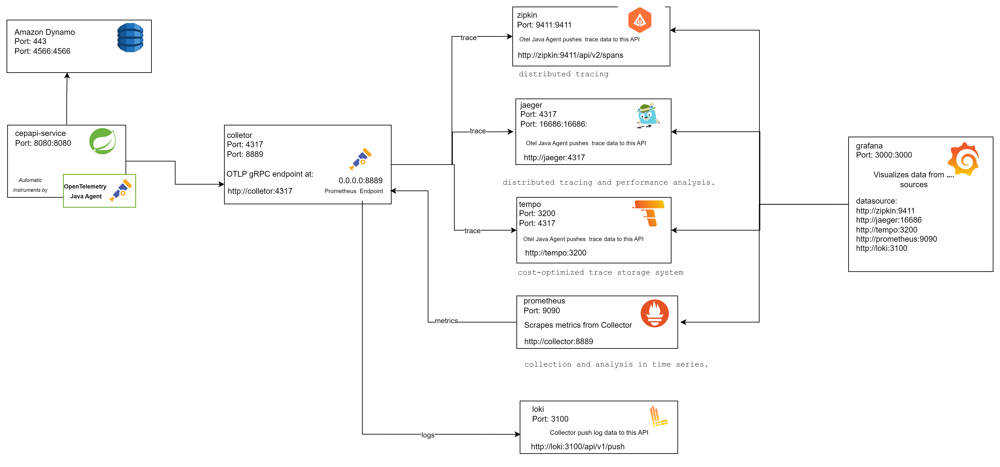

# Projeto Spring Boot 3 para Consulta de CEP com Integração aos Correios

Este projeto cria uma API RESTful em **Spring Boot 3** que consulta CEPs utilizando a API dos Correios. Ele segue os princípios **SOLID** e incorpora diversas ferramentas e práticas modernas para garantir resiliência, monitoramento e rastreamento.

---

## **Funcionalidades**

- Consulta de CEP utilizando a API dos Correios.
- Monitoramento com **Prometheus**.
- Rastreamento distribuído com **OTLP (OpenTelemetry Protocol)**.
- Redução de código boilerplate com **Lombok**.
- Endpoints de monitoramento com **Spring Actuator**.
- Resiliência de chamadas externas com **Resilience4j**.

---

## **Tecnologias Utilizadas**

- **Spring Boot 3**
- **Prometheus**
- **Grafana com Dash Boarding**
- **OpenTelemetry**
- **Lombok**
- **Spring Actuator**
- **Resilience4j**
- **LocalStack**
- **AWS SQS**
- **AWS DynamoDB**
- **Wiremock-gui**
- **Jaeger Tracing**

---

## **Estrutura do Projeto**

O projeto adota uma **arquitetura em camadas**, organizada da seguinte forma:

- **Controller**: Gerencia os endpoints REST.
- **Service**: Implementa a lógica de negócio.
- **Repository**: Gerencia cache ou persistência (armazenamento de logs de consulta).
- **Client**: Integra-se à API dos Correios.
- **Exception Handling**: Implementa o tratamento de exceções com **ControllerAdvice**.

### Arquitetura Software C4 Model

---

## **Pacotes**

Os pacotes seguem o prefixo `br.com.mkcf.cepapi`, conforme descrito:

- **`br.com.mkcf.cepapi.controller`**: Contém a classe `CepController` para os endpoints REST.
- **`br.com.mkcf.cepapi.service`**: Contém a classe `CepService` com a lógica de negócio.
- **`br.com.mkcf.cepapi.client`**: Contém a classe `CorreiosClient` para integração com a API dos Correios.
- **`br.com.mkcf.cepapi.dto`**: Contém a classe `CepResponse` representando o modelo de dados da resposta de consulta.
- **`br.com.mkcf.cepapi.config`**: Contém a classe `AppConfig` para configurar beans como o `RestClient`.
- **`br.com.mkcf.cepapi.exception`**: Contém classes para tratamento de exceções, como `GlobalExceptionHandler`.

---

## **Diagrama**


---

## **Pré-requisitos**

Certifique-se de ter instalados:

- **Java 17** ou superior.
- **Docker** e **Docker Compose** para execução do ambiente.

---

## **Como Executar**

1. Clone o repositório:
   ```bash
   git clone https://github.com/seu-usuario/seu-repositorio.git
   cd seu-repositorio
   ```

2. Suba o ambiente com Docker Compose:
   ```bash
   docker-compose up
   ```

3. Acesse a API em: [http://localhost:8080](http://localhost:8080)

---
## **Endpoints**
- **GET /cep/{cep}**: Consulta informações de um CEP específico.
---


