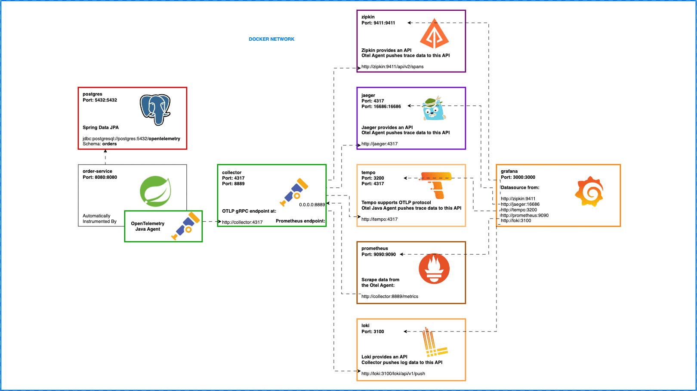

## Projeto Spring Boot 3 para Consulta de CEP com Integração aos Correios

Este projeto cria uma API RESTful em **Spring Boot 3** que consulta o CEP utilizando a API dos Correios, seguindo os princípios **SOLID** e incorporando:
- **Prometheus** para monitoramento,
- **OTLP (OpenTelemetry Protocol)** para rastreamento,
- **Lombok** para reduzir boilerplate code,
- **Spring Actuator** para endpoints de monitoramento,
- **Resilience4j** para resiliência de chamadas externas.

### Estrutura do Projeto

**Arquitetura em Camadas**:
- **Controller**: Responsável pelo endpoint REST.
- **Service**: Aplica a lógica de negócio.
- **Repository**: Acesso ao cache ou persistência (para armazenar logs de consulta).
- **Client**: Integração com a API dos Correios.
- **Exception Handling**: Tratamento de exceções usando **ControllerAdvice**.

### Pacotes
Os pacotes do projeto são organizados a partir do prefixo `br.com.mkcf.cepapi`, conforme descrito a seguir:

- **br.com.mkcf.cepapi.controller**: Contém a classe `CepController` responsável pelos endpoints REST.
- **br.com.mkcf.cepapi.service**: Contém a classe `CepService` que implementa a lógica de negócio.
- **br.com.mkcf.cepapi.client**: Contém a classe `CorreiosClient` responsável pela integração com a API dos Correios.
- **br.com.mkcf.cepapi.dto**: Contém a classe `CepResponse` que representa o modelo de dados da resposta de consulta ao CEP.
- **br.com.mkcf.cepapi.config**: Contém a classe `AppConfig` para a configuração de beans como o `RestClient`.
- **br.com.mkcf.cepapi.exception**: Contém classes para tratamento de exceções, como `GlobalExceptionHandler`.




execução:
```sh
> docker-compose.exe -f .\docker-compose.yml up 
```

